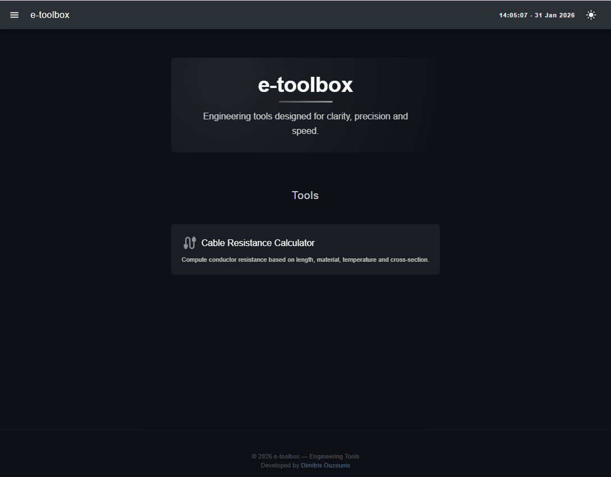
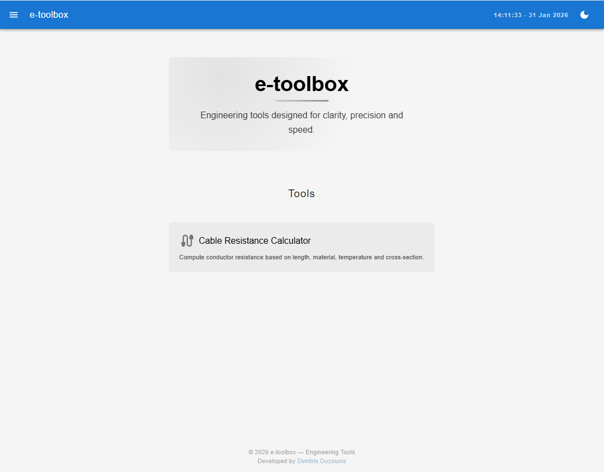
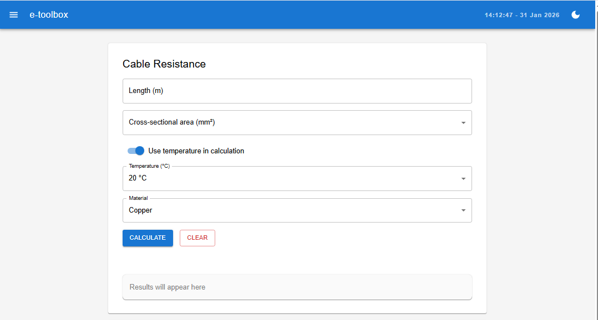
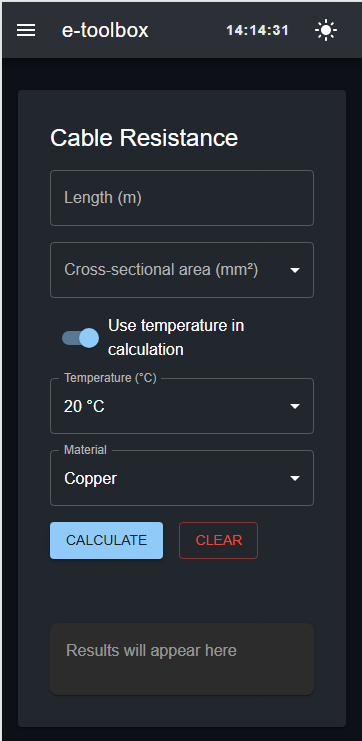

# e‑toolbox

Engineering tools designed for clarity, precision and speed.

https://jimouz.github.io/e-toolbox/

## Overview

e‑toolbox is a modern, theme‑aware collection of engineering tools designed for quick, accurate calculations.
It focuses on clean UI, smooth interactions, and a consistent experience across all devices.

## Features

- Clean, minimal UI with light/dark theme
- Fast, accurate engineering calculations
- Responsive layout for mobile and desktop
- Reusable components for consistent design
- Smooth interactions and clear visual feedback

## Tech Stack

- React for UI and component architecture
- MUI for theming and base styling
- Vite for fast development and builds
- JavaScript with modular, maintainable structure
- GitHub Pages for deployment

## Installation

Clone the repository and install dependencies:

```bash
git clone https://github.com/jimouz/e-toolbox.git
cd e-toolbox
npm install
npm run dev
```

## Screenshots

### Dark Theme Homepage






## Roadmap

- Add more engineering tools
- Improve accessibility and keyboard navigation
- Add unit tests (Jest + React Testing Library)
- Enhance mobile UI and micro‑interactions
- Add export options for results (PDF/CSV)
- Explore PWA support for offline use

## Author

Developed by Dimitris Ouzounis

- Portfolio: https://jimouz.github.io/portfolio
- GitHub: https://github.com/jimouz

## License

This project is licensed under the MIT License.
